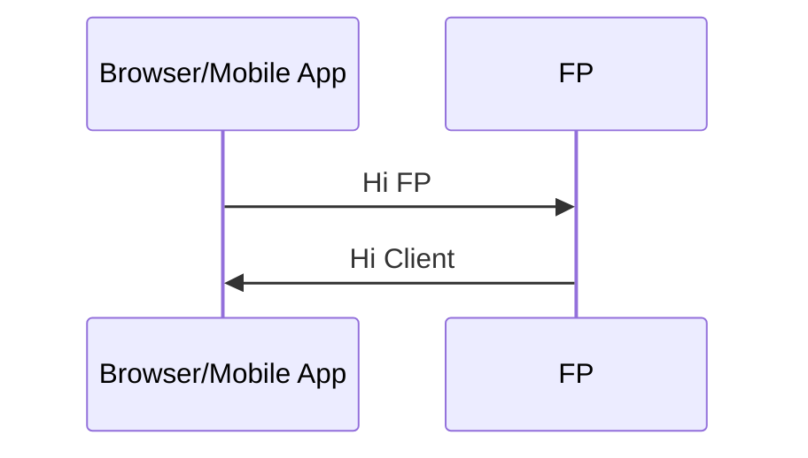
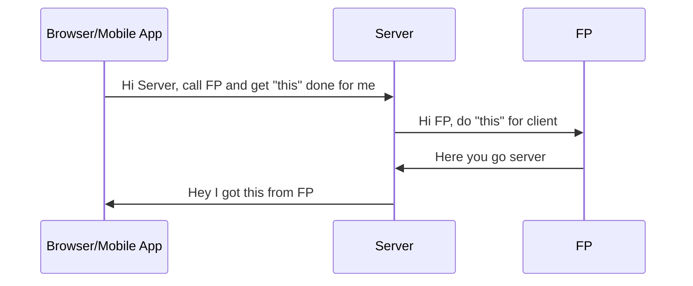
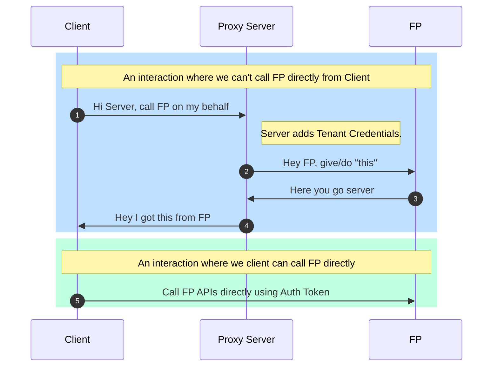
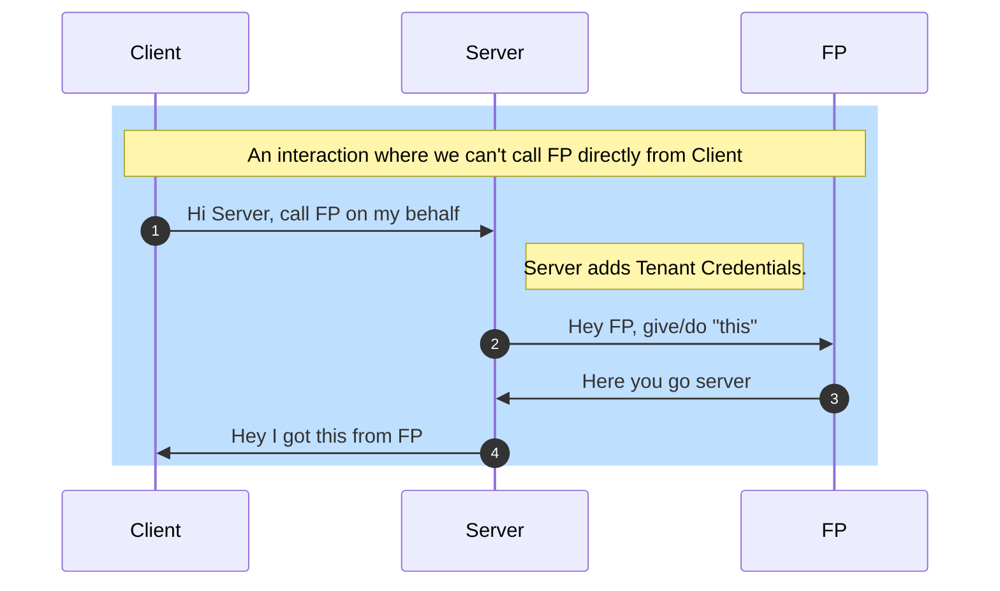

## Best Practices Guide - Integrate FP APIs into your applications

#### FP can help you start, run, and grow an existing business. This guide helps you understand various ways that best support your business model and current state.

There are two ways to interact with FP APIs:
- Client Side Integration (Client here can mean - Web/Mobile/Desktop/Console).
- Server Side Integration

> How FP makes the above possible: FP APIs work with an API Token. Based on the scenario, the token you have to use might differ. For example, in case your application wants to authenticate (signup/login) a user, you would be using a Tenant Token. Once the user logins, you can use Investor Token and communicate with FP APIs from the client side.

### Client Side Integration
The following diagram is an oversimplified representation of how Client Side Integration is possible with FP.

Before diving into Client Side Integration, let's look at a simple flow of Server Side Integration.

### Server Side Integration

The above diagrams should show how Client Side and Server Side Integrations differ: A server component communicates with FP APIs. Synonymously, we might call the "Server," a "Middleware," or a "Proxy" based on the context of the integration and the purpose of this component.

The type of integration is not mutually exclusive to the Client Side or the Server Side only; you might end up using both kinds of integrations based on context. That's why it's crucial to understand how different integrations work.

### Types of Applications
Broadly, the types of applications you might be building can be divided into:
1. Develop a client application with a No/Low Code server
2. Develop a client application and server on FP APIs

Before we delve into the implementation details, it would make sense to segregate how your application's "current state" might impact the decision.

| Current State | Intention | Recommendations | Ref |
| ------ | ------ | ------ | --- |
| You don't have any application | Build a client application using FP Auth | Use a No/Low Code Server, and call FP APIs from the client using auth token generated after user login | 1.1 |
| You don't have any application | Build a client application with your authentication | Use a No/Low Code Server, and call FP APIs from the client using auth token generated by your backend after exchanging the tenant token for an investor token (Coming Soon)  |  1.2 - Approach 1 |
| You don't have any application | Build a client application with your authentication, but you don't want to call FP APIs from the client | Use a No/Low Code Server and aim to keep it lightweight, write a proxy layer to interface with FP APIs  |  1.2 - Approach 2 |
| You have an existing application | Integrate FP APIs into your client, and you have your authentication | Use a No/Low Code Server, and call FP APIs from the client using auth token generated by your backend after exchanging tenant token for an investor token (Coming Soon)  |  1.2 - Approach 1  |
| You have an existing application | Integrate FP APIs into your client, and you have your authentication but don't want to call FP APIs from frontend | Use a No/Low Code Server and aim to keep it lightweight, write a proxy layer to interface with FP APIs  |  1.2 - Approach 2 |
| You have an existing application | You don't want to call FP APIs from frontend. | Use a No/Low Code Server and aim to keep it lightweight, write a proxy layer to interface with FP APIs | 2 |

#### 1. Develop a client application with No/Low Code server

Using the following diagram as a reference, you would be doing two integrations:
- Communicate with some of the FP APIs from your server (Blue Box).
- Communicate with most of the FP APIs from your client (Light Green Box)

You have to use a different type of Token to accomplish the above:
- Use Tenant Token while communicating from server
- Use Auth Token while communicating from client

Let's look at kinds of implementation and solutions for those.
#### 1.1 New Client Application with FP Authentication**
In this case, you are building a brand-new shiny client application for your users with our UX/UI customizations. As FP provides solutions even for Authentication, you want to leverage it.

**Client Side Integration**
- Pick your frontend Technology like React/Angular/Vue.
- Add our SDK `https://www.npmjs.com/package/@fintechprimitives/fpapi` from NPMJS.
- And follow our guide and start calling FP APIs directly from the client.

**Server Side Integration**
- You need a lightweight backend that works like a proxy to FP APIs.
- If you opt to develop your backend in nodejs or nodejs-based frameworks, `@fintechprimitives/fpapi` works there too.
- You would be using the server to call some FP APIs (like: search user, search investor, login user, etc.,).

#### 1.2 New/Existing Client Application with Custom Authentication
For some important reason, you decided you need your authentication (Maybe your application supports use cases more than FP offers). Also, just because you already have an application doesn't mean you have to do the heavy lifting. In this case, also, you can leverage a Low Code integration.

- We would suggest writing a very thin nodejs microservice.
- Integrate `@fintechprimitives/fpapi` into it.
- Plugin the values needed by FP SDK.

**Approach 1 (Coming Soon)**
- You can still call FP APIs from Frontend.
- Generate an Auth Token from Investor from Backend (Exchange Tenant Token for Investor Token).

**Approach 2**
- Use Tenant Token to call FP APIs in your backend.

#### 2. Develop your own frontend and backend on FP APIs
In this implementation, your server will communicate with all FP APIs.

The solutions for using FP here vary based on the available FP SDKs.

#### 2.1 Javascript Based
You can use our nodejs SDK to integrate FP APIs seamlessly into the your backend.

#### 2.2 API Based
FP APIs are intuitive and developer friendly. In case we don't have an SDK, give our APIs a read, contact our solutions team, and in no time, you will be thinking of solutions you can build on.

