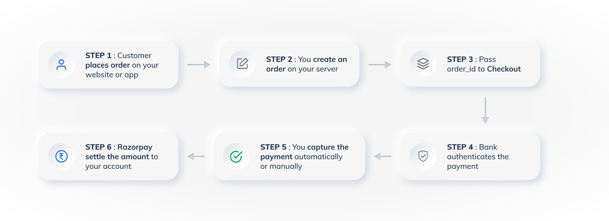

## Using Razorpay SDK options

Razorpay provides the option to customise the checkout page by using their SDK. Fintech Primitives payment APIs provide the relevant SDK options that can be passed on to the Razorpay SDK and achieve customised Payment Checkout page for your customers.

These SDK options can be used to customise the payment checkout page for both payment via Netbanking/UPI as well as to authorise the E-Mandates via Netbanking/UPI

#### Netbanking/UPI Payment gateway:

Note: Please refer to the [Razorpay standard checkout integration](https://razorpay.com/docs/payments/payment-gateway/web-integration/standard/) for detailed documentation.

Razorpay Integration consists of six steps as given in their [documentation](https://razorpay.com/docs/payments/payment-gateway/web-integration/standard/):



In the above flow, we will focus on the following steps:

a. You create an order on your server:
  - For each mutual fund schemes that the Investor wants to purchase, an order must be created in your database(If you are maintaining a DB) and must also create the MF purchase order in FP by using the [MF purchase API](https://fintechprimitives.com/docs/api/#create-a-mf-purchase).

b. Pass order_id to Checkout
  - Instead of directly creating an order in Razorpay, Payment must be created in FP for one or more MF purchase orders created in step 1 by using [Create Payment API](https://fintechprimitives.com/docs/api/#create-a-payment).
  - FP internally passes on these FP purchase order IDs to Razorpay and generates the Razorpay 'order_id' in the response. Please refer to the request and response of [Create Payment API](https://fintechprimitives.com/docs/api/#create-a-payment).
  
  **Payment creation API Request:**

  ```
  curl -X POST "{{base_url}}/api/pg/payments/netbanking"
    -H "x-tenant-id: <tenant name>"
    -H "Authorization: Bearer ACCESS_TOKEN"
    -d '
      {
    "amc_order_ids": [
      1,
      2
    ],          //Order Ids of the orders created in FP. Here we are creating the payment for two Mutual funds purchase.
    "payment_postback_url": "https://example.com/"
  }

  ```
  **Payment creation API Response:**

  ```json

  {
      "id": 1692,
      "token_url": "{{base_url}}/api/pg/payments/netbanking/razorpay?txnId=2c8a6e76-f622-47d8-90c2-746f9fb1d577&txnType=0",
      "sdk_options": {
          "razorpay": {
              "callback_url": "{{base_url}}/api/pg/payments/netbanking/razorpay/capture/1692",
              "bank_code": "ICIC",
              "amount": 100000,
              "method": {
                  "wallet": false,
                  "netbanking": true,
                  "card": false,
                  "upi": false
              },
              "order_id": "order_LD3UyrIMhixgTU", \\Razorpay 'order_id'
              "key": "rzp_test_yOMeNF4w46S7lK"
          }
      }
  }

  ```
c. Now the parameters received in the above response as 'sdk_options' -> 'razorpay' must be passed on while integrating Razorpay SDK in any of the platforms such as web, Andoid or IOS.
  - For example, while integrating with web app as detailed in [Razorpay documentation](https://razorpay.com/docs/payments/payment-gateway/web-integration/standard/build-integration#code-to-add-pay-button), SDK parameters must be passed from the response received from the [FP Create Payment API](https://fintechprimitives.com/docs/api/#create-a-payment) as detailed in the comments in the code below(Code for Pay button copied here for clarity)
> Note: Example below for netbanking checkout with callback URL is for reference. Similarly netbanking checkout with handler functions can also be implemented as given in Razorpay documentation.
  ```javascript

  <button id="rzp-button1">Pay</button>
  <script src="https://checkout.razorpay.com/v1/checkout.js"></script>
  <script>
  var options = {
      "key": "FP_Payment_response.sdk_options.razorpay.key", // Enter the Key ID generated from the Dashboard
      "amount": "FP_Payment_response.sdk_options.razorpay.amount", //Use the amount received from FP payment response -> SDK_options -> razorpay -> amount.
  // Amount is in currency subunits. Default currency is INR. Hence, 50000 refers to 50000 paise
      "currency": "INR",
      "name": "Acme Corp", //your business name
      "description": "Test Transaction",  
      "image": "https://example.com/your_logo",  //Your Business logo
      "order_id": "FP_Payment_response.sdk_options.razorpay.order_id", //Use the order ID received from FP payment response -> SDK_options -> razorpay -> order_id.
      "callback_url": "FP_Payment_response.sdk_options.razorpay.callback_url", //Use the callback_URL received from FP payment response -> SDK_options -> razorpay -> callback_url.
      "prefill": {
          "name": "Gaurav Kumar", //your customer's name
          "email": "gaurav.kumar@example.com",
          "contact": "9000090000"
      },
      "retry": {
          "enabled": false,          
      },
      "notes": {
          "address": "Your Corporate Office"
      },
      "theme": {
          "color": "#3399cc"        //Your Brand color
      }
  };
  var rzp1 = new Razorpay(options);
  document.getElementById('rzp-button1').onclick = function(e){
      rzp1.open();
      e.preventDefault();
  }
  </script>
  ```
> Note: Please pass the 'retry' parameter as 'false' to avoid any payment related errors as FP does not support checkout retry mechanism at the moment. We are working on providing this functionality soon.

d. FP uses [Third Party Verification(TPV)](https://razorpay.com/docs/payments/third-party-validation/) feature to restrict the Investor to only use the registered bank account for making purchases. 
FP passes these details to Razorpay when the [payment is created in FP](https://fintechprimitives.com/docs/api/#create-a-payment).So when the Razorpay order ID is passed to the SDK, bank selection and mode of payment (Netbanking/UPI) are restricted to the Investor by default.

#### Mandate SDK options:

Similar steps must be followed as outlined for payment above for Mandate authorisation page customisation using Razorpay SDK. Please refer to [Razorpay documentation for E-Mandate authorisation] (https://razorpay.com/docs/api/payments/recurring-payments/emandate/create-authorization-transaction)

a. In order to create the authorisation transaction, first create a mandate in FP by using [Create mandate API](https://fintechprimitives.com/docs/api/#create-a-mandate-enach)
b. Once the mandate is created for an investor, create the authorisation transaction for the mandate generated in step 1 using [Authorise Mandate API](https://fintechprimitives.com/docs/api/#authorize-a-mandate-enach) by passing the mandate ID. Please see the request/response below:

  **Mandate auth Request:**
  ```

  curl "{{base_url}}/api/pg/payments/emandate/auth"
    -H "x-tenant-id: <tenant name>"
    -H "Authorization: Bearer ACCESS_TOKEN"
    -d '
      {
    "mandate_id": 1,
    "payment_postback_url": "https://example.com/"
  }

  ```
  **Mandate auth Response:**
  ```json

  {
      "id": 1692,
      "token_url": "{{base_url}}/api/pg/payments/netbanking/razorpay?txnId=2c8a6e76-f622-47d8-90c2-746f9fb1d577&txnType=0",
      "sdk_options": {
          "razorpay": {
              "callback_url": "{{base_url}}/api/pg/payments/netbanking/razorpay/capture/1692",
              "bank_code": "ICIC",
              "amount": 100000,
              "method": {
                  "wallet": false,
                  "netbanking": true,
                  "card": false,
                  "upi": false
              },
              "bank_account_holder_name": "Abhin",   
              "customer_id": "cust_LN282jrS8faukL",
              "order_id": "order_LPLoYDzTOOKCUD",
              "bank_account_ifsc": "ICIC0000801",
              "key": "rzp_test_yOMeNF4w46S7lK"
          }
      }
  }

  ```

c. Create authorisation payment checkout page using Razorpay SDK as detailed here: https://razorpay.com/docs/api/payments/recurring-payments/emandate/create-authorization-transaction#113-create-an-authorization-payment 

  ```javascript

    <button id = "rzp-button1"> Pay </button>
      <script src = "https://checkout.razorpay.com/v1/checkout.js"> </script>
      <script>
        var options = {
          "key": "FP_MandateAuth_response.sdk_options.key",           
          "order_id": "FP_MandateAuth_response.sdk_options.order_id",
          "customer_id": "FP_MandateAuth_response.sdk_options.customer_id",
          "recurring": "1",
          "handler": function (response) {
            alert(response.razorpay_payment_id);
            alert(response.razorpay_order_id);
            alert(response.razorpay_signature);
          },
          "notes": {
            "note_key 1": "Beam me up Scotty",
            "note_key 2": "Tea. Earl Gray. Hot."
          },
          "theme": {
            "color": "#F37254"
          }
        };
        var rzp1 = new Razorpay(options);
        document.getElementById('rzp-button1').onclick = function (e) {
          rzp1.open();
          e.preventDefault();
        }
      </script>
  ```

> Note: Similarly authorisation checkout page with callback URL can also be created as detailed in Razorpay documentation.
